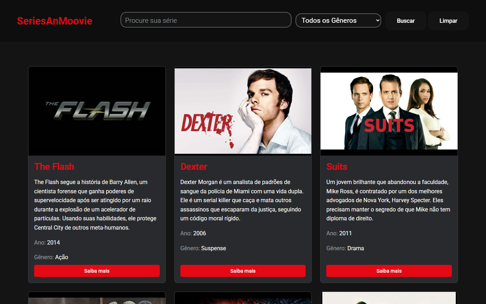

# 🎬 Catálogo de Séries - Projeto Alura

Este projeto é uma aplicação web simples que exibe um catálogo de séries de TV. As informações de cada série são carregadas a partir de um arquivo JSON local e apresentadas de forma organizada e visualmente agradável para o usuário.

Este projeto foi desenvolvido como parte dos estudos na plataforma Alura.

**Veja no ar:** <https://enzogaliazzo.github.io/ProjetoAlura/>

## ✨ Funcionalidades

- **Listagem de Séries**: Exibe uma coleção de séries a partir de uma base de dados local.
- **Busca e Filtro**: Busca por nome ou sinopse enquanto você digita, e filtro por gênero.
- **Detalhes da Série**: Para cada item, são mostrados:
  - Imagem de capa
  - Nome
  - Descrição/Sinopse
  - Ano de lançamento
  - Gênero
- **Saiba mais**: Abre uma janela com os detalhes da série e um link para uma página com mais informações (como Wikipédia ou IMDb).
- **Capa de reserva**: Se o pôster de uma série não carregar, o card mostra uma capa com o nome e o gênero da série no lugar da imagem quebrada.

## 🖼️ Demonstração



## 🛠️ Tecnologias Utilizadas

O projeto foi construído utilizando tecnologias web padrões:

- **HTML5**: Para a estrutura semântica da página.
- **CSS3**: Para a estilização e o layout dos componentes.
- **JavaScript**: Para a manipulação do DOM e o carregamento dinâmico dos dados do JSON.
- **JSON**: Como formato para armazenar os dados das séries.

## 📂 Estrutura do Projeto

```
ProjetoAlura/
├── 📄 index.html       # Arquivo principal da aplicação
├── 🎨 style.css         # Folha de estilos
├── ⚙️ script.js         # Lógica da aplicação em JavaScript
├── 📦 data.json         # Banco de dados com as séries
├── 📄 login.html       # Tela de escolha de perfil
├── 🎨 login.css         # Estilos da tela de perfil
├── 🖼️ screenshot.png    # Imagem usada neste README
└── 📄 README.md         # Documentação do projeto
```

### Estrutura do `data.json`

O arquivo `data.json` contém uma lista de objetos, onde cada objeto representa uma série e possui a seguinte estrutura:

```json
[
  {
    "nome": "Nome da Série",
    "descricao": "Uma breve sinopse sobre a série.",
    "ano": 2023,
    "genero": "Gênero da Série",
    "link": "URL para mais informações",
    "imagem": "URL da imagem de capa"
  }
]
```

## 🚀 Como Executar o Projeto

Como este é um projeto front-end estático, basta um servidor local simples para executá-lo.

1.  **Clone o repositório** (ou baixe os arquivos):
    ```bash
    git clone https://github.com/EnzoGaliazzo/ProjetoAlura.git
    ```

2.  **Sirva a pasta com um servidor local**, por exemplo com a extensão Live Server do VS Code ou com:
    ```bash
    npx serve .
    ```
    Abrir o `index.html` com dois cliques não funciona: o navegador bloqueia o carregamento do `data.json` quando a página é aberta direto do disco.

Pronto! A aplicação será carregada e exibirá o catálogo de séries.

---

Feito com ❤️ por **[Enzo Rezende](https://github.com/EnzoGaliazzo)**.
